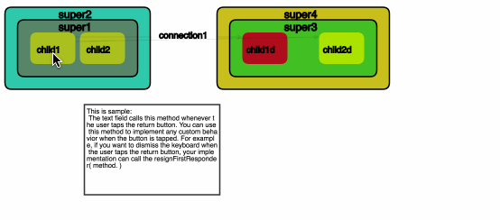

# recognisedCanvasJs

This is simplest javascript library for drawing the recognisable object on Canvas.
The main concept is to make it easier following points

 1. All diagram should be managed as object (There is two type object)
  * the object is charge of drawing only 
  * the object is charge of drawing and detecting event
 2. Prepared various shape drawing object
 3. Click/Drag/Hover event against the object is detected
 4. Expression the parent and child relation about the object
  * the parent object size is always re-calculated so that enclose all child object
 5. Connect between each object with arrow line 
  * the connecting point is automatically re-calculated according to the place of opponent to be connected

# How to Use it
## TODO

## Sample

# Used by 
 * [Container Visualise](https://github.com/ukinau/container-visualise)

